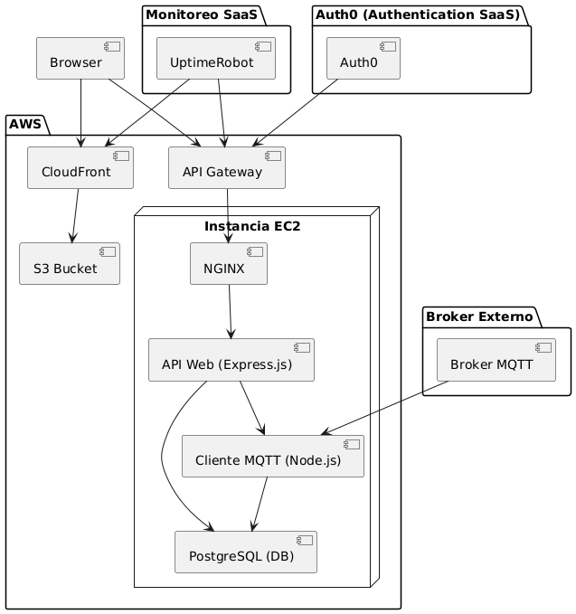

# Proyecto Monitoreo de Stocks – Entrega 1
---
## 1. Descripción general del proyecto
Este proyecto consiste en una aplicación web de monitoreo de acciones bursátiles (stocks), desplegada sobre infraestructura en AWS utilizando servicios de contenedores y almacenamiento distribuido.
El sistema está compuesto por dos grandes partes:

### Backend:
- Desarrollado en Node.js utilizando Express para la creación de una API REST.
- Incluye un cliente MQTT que se conecta a un broker externo para recibir eventos de nuevas acciones en tiempo real.
- Utiliza PostgreSQL como base de datos para almacenar de manera persistente los datos de stocks recibidos.
- Todo el backend está contenerizado utilizando Docker y orquestado mediante docker-compose.
- Se despliega sobre una instancia AWS EC2.

### Frontend:
- Aplicación web desarrollada para ser consumida por navegadores.
- El frontend es una aplicación estática que se construye y almacena en un bucket S3.
- Se distribuye públicamente utilizando AWS CloudFront como CDN.

#### Adicionalmente, se incorporan componentes de seguridad y monitoreo:
- API Gateway + Auth0:
Para proteger el acceso a la API REST, todas las solicitudes pasan a través de API Gateway, que autentica utilizando Auth0 como proveedor de identidad SaaS.
- Monitoreo SaaS (UptimeRobot):

La disponibilidad de los servicios tanto de frontend (CloudFront) como de backend (API Web) se supervisa mediante UptimeRobot, generando alertas automáticas en caso de caídas o problemas de disponibilidad.

Esta arquitectura modular y basada en servicios asegura una alta disponibilidad, escalabilidad y facilidad de mantenimiento.

## 2. Flujo de Monitoreo SaaS

El sistema utiliza UptimeRobot, el cual es un servicio SaaS de monitoreo que permite supervisar endpoints públicos a intervalos regulares.

### Endpoints Monitoreados

Se configuran dos monitores HTTP(s) en UptimeRobot:

#### API Gateway Endpoint:

- URL: https://[api-gateway-url]/stocks
- Verifica la disponibilidad del backend (API Web desplegada en EC2).

#### CloudFront Distribution Endpoint:

- URL: https://[cloudfront-distribution-id].cloudfront.net
- Verifica la disponibilidad del frontend (sitio web servido desde S3 vía CloudFront).

### Configuración del Monitoreo
- **Tipo de monitor:** HTTP(s)
- **Intervalo de chequeo:** Cada 5 minutos (default en plan gratuito)
- **Alertas:**
    - Se envía una alerta por correo electrónico en caso de caída.
    - El servicio reintenta la comprobación antes de generar una alerta real para evitar falsos positivos.

### Seguimiento y Visualización

#### Desde el panel de UptimeRobot, se pueden visualizar:

- Gráficas de tiempo de actividad (Uptime %)
- Tiempos de respuesta promedio
- Historial de incidentes y caídas

Cada monitor genera estadísticas separadas para el backend y el frontend.

### Importancia del Monitoreo
El monitoreo permite:
- Asegurar que el servicio API y la página web estén disponibles para los usuarios.
- Detectar problemas de despliegue, caídas del servidor o fallos en la configuración de red.
- Mejorar la confiabilidad del sistema entregando un canal de alerta inmediato ante incidentes.

## 3. Instalación Local

### Requisitos Previos
Antes de comenzar, asegúrate de tener instalados en tu máquina:
- Node.js (versión recomendada ≥ 18.x)
- npm (gestor de paquetes de Node.js)
- Docker (opcional si deseas levantar los servicios usando contenedores)
- Docker Compose (opcional)

### Instalación y ejecución del Backend

1. Clonar el repositorio del backend

```bash
git clone https://github.com/noamsito/backend-2173.git
cd backend-2173
```
2. Instalar dependencias

```bash
npm install
```

3. Crear archivo .env
Crea un archivo .env en la raiz del proyecto con las siguientes variables de entorno:

```bash
DATABASE_USER=postgres
DATABASE_PASSWORD=tu_password
DATABASE_HOST=localhost
DATABASE_NAME=stocks_db
DATABASE_PORT=5432

MQTT_USER=students
MQTT_PASSWORD=iic2173-2025-1-students
MQTT_HOST=broker.iic2173.org
MQTT_PORT=9000
MQTT_TOPIC=stocks/info

PORT=3000
```
*(Asegúrate de que tu base de datos PostgreSQL esté corriendo localmente, o configura la conexión correctamente.)*

4. Levantar el servidor Backend

Para desarrollo sin contenedores:

```bash
npm run dev
```
*(Puede ser npm start si tu package.json así lo define.)*

El servidor quedará escuchando en http://localhost:3000.

### Instalación y ejecución del Frontend

1. Clonar el repositorio del frontend

```bash
git clone https://github.com/noamsito/frontend-2173.git
cd frontend-2173
```

2. Instalar dependencias

```bash
npm install
```
3. Crear archivo .env

Dependiendo de la configuración del frontend, puede ser necesario definir variables como la URL de la API backend. Ejemplo:

```bash
VITE_API_URL=http://localhost:3000

```

4. Levantar el servidor frontend en modo desarrollo

```bash
npm run dev
```
El servidor de desarrollo generalmente quedará disponible en http://localhost:5173 (o el puerto configurado por Vite).

### Opcional: Levantar servicios con Docker
Si deseas utilizar docker para levantar todo: 

```bash
sudo docker compose up --build
```
Esto levantará:

- API Web

- Cliente MQTT

- Base de datos PostgreSQL (contenedorizada)

*(Asegúrate de tener el archivo docker-compose.yml y los Dockerfile configurados correctamente.)*

## 4.  Instalación y despliegue en producción (EC2 + Docker)

### Requisitos previos

- Cuenta en AWS con permisos para EC2, S3, CloudFront y API Gateway.
- Instancia EC2 (Ubuntu Server recomendado).
- Docker y Docker Compose instalados en la instancia.
- Claves SSH para acceso a la instancia.
- DNS opcional (si quieres apuntar a un dominio).

#### Despliegue del Backend en EC2

1. Conectar a la instancia EC2
Desde tu maquina local:
```bash
ssh -i /ruta/a/tu/archivo.pem ubuntu@[IP_PUBLICA_EC2]
```

2. Clonar el proyecto backend
Dentro de la instancia EC2:
```bash
git clone https://github.com/noamsito/backend-2173.git
cd backend-2173

```

3. Crear archivo .env
Crear el archivo .env en la raíz del backend con las variables de entorno necesarias para producción:
```bash
DATABASE_USER=postgres
DATABASE_PASSWORD=contrasena
DATABASE_HOST=db
DATABASE_NAME=stocks_db
DATABASE_PORT=5432

MQTT_USER=students
MQTT_PASSWORD=iic2173-2025-1-students
MQTT_HOST=broker.iic2173.org
MQTT_PORT=9000
MQTT_TOPIC=stocks/info

PORT=3000
```
*(Asegúrate que DATABASE_HOST=db, porque la base de datos corre en su propio contenedor.)*

4. Levantar contenedores con Docker Compose
Desde la carpeta del backend:

```bash
sudo docker compose up --build -d
```

Esto creará y levantará:
- Contenedor del API Web (Express)
- Contenedor del Cliente MQTT (Node.js)
- Contenedor de PostgreSQL (DB)

5. 6. Configurar API Gateway
En AWS:
- Crear una nueva API REST en API Gateway.
- Definir recursos y métodos.
- Hacer que reenvíe tráfico al endpoint público de tu EC2 o NGINX.
- Configurar Auth0 como proveedor de autorización.

### Despliegue del frontend en S3 + Cloudfront

1. Construir el frontend
En tu maquina local
```bash
ssh -i /ruta/a/tu/archivo.pem ubuntu@[IP_PUBLICA_EC2]
```
Esto genera una carpeta /dist o /build.

2. Subir archivos a S3
- Crear un bucket S3.
- Habilitar Static Website Hosting.
- Subir los archivos del directorio /dist o /build al bucket.

3. Crear distribución CloudFront
- Crear una distribución en CloudFront apuntando al bucket S3.
- Configurar redirección a HTTPS.
- Definir index.html como documento raíz.
- Obtener la URL pública de CloudFront.

## 5. Arquitectura del sistema

El sistema se organiza en componentes distribuidos sobre infraestructura de AWS, apoyados por servicios SaaS para autenticación, monitoreo y entrega de contenido. La arquitectura sigue un enfoque modular basado en contenedores y servicios separados para mayor escalabilidad y mantenibilidad.

A continuación, se describen los principales componentes:
---
### Componentes principales en AWS:
#### EC2 Instance:
- Corre los contenedores de:
    - NGINX (proxy reverso)
    - API Web (Express.js) (servidor de la API REST)
    - Cliente MQTT (Node.js) (escucha eventos de stocks)
    - Base de Datos PostgreSQL (almacena datos de acciones)

#### S3 Bucket:
- Almacena los archivos estáticos del frontend (HTML, CSS, JS) generados a partir del build.

#### CloudFront:
- Distribuye los contenidos del S3 Bucket de manera eficiente mediante una CDN segura.

#### API Gateway:
- Gestiona las solicitudes entrantes a la API Web.
- Se integra con Auth0 para validar la autenticación.

### Servicios Externos:
#### Auth0:
- Servicio SaaS utilizado para la autenticación de usuarios mediante tokens de acceso.

#### Broker MQTT:
- Fuente de eventos de datos bursátiles en tiempo real, consumidos por el Cliente MQTT.

#### Monitoreo SaaS (UptimeRobot):
- Supervisa la disponibilidad de:
    - API Gateway (Backend)
    - CloudFront (Frontend)
- Envía alertas en caso de caídas.

### Diagrama de Componentes
El diagrama UML de componentes ilustra gráficamente las interacciones entre todos los servicios y módulos del sistema:


#### Descripción general del flujo:
1. El navegador accede al frontend servido desde CloudFront/S3.

2. Las solicitudes API son dirigidas a través de API Gateway.

3. API Gateway valida autenticación con Auth0.

4. API Gateway enruta a NGINX, que a su vez dirige a la API Web.

5. La API Web se comunica con la base de datos y, cuando corresponde, con el Cliente MQTT.

6. El Cliente MQTT mantiene una suscripción activa al Broker MQTT externo y almacena eventos recibidos en PostgreSQL.

7. Todo el sistema es monitoreado externamente mediante UptimeRobot.